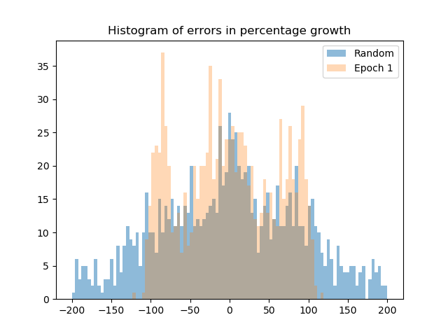
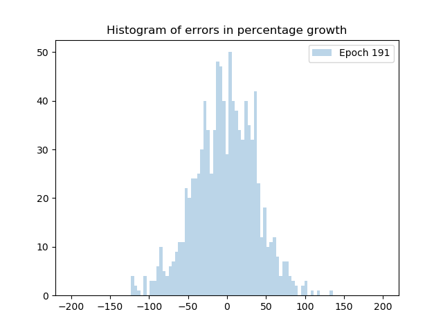
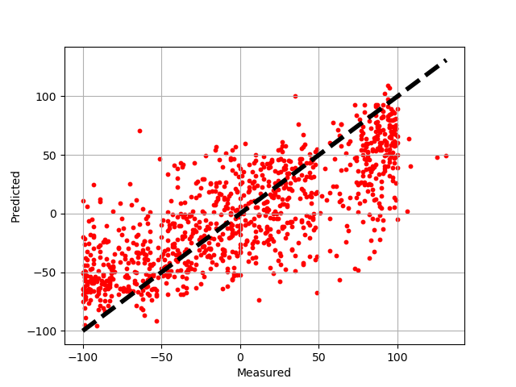

### Model Description
The Pilot 1 Single Drug Response Predictor benchmark, also called P1B3, is a deep neural network for modeling cell line response to treatments of single drug. Given drug screening results on NCI-60 cell lines, the model can predict the growth percentage from cell line gene expression data, drug concentration and drug descriptors. This benchmark is a simplified form of the core drug response prediction problem in which we need to combine multiple molecular assays and a diverse array of drug feature sets to make a prediction. The expected outcome of this benchmark is to build a deep neural network that can predict growth percentage of a cell line treated with a new drug.

### Benchmark Specs Requirements

#### Description of the Data
* Data source: Dose response screening results from NCI; 5-platform normalized expression data from NCI; Dragon7 generated drug descriptors based on 2D chemical structures from NCI
* Input dimensions: ~30K with default options: 26K normalized expression levels by gene + 4K drug descriptors [+ drug concentration]
Output dimensions: 1 (growth percentage)
* Sample size: millions of screening results (combinations of cell line and drug); filtered and balanced down to ~1M
* Notes on data balance: original data imbalanced with many drugs that have little inhibition effect

#### Expected Outcomes
* Regression. Predict percent growth for any NCI-60 cell line and drug combination 
* Dimension: 1 scalar value corresponding to the percent growth for a given drug concentration. Output range: [-100, 100]

#### Evaluation Metrics
* Accuracy or loss function: mean squared error or rank order.
* Expected performance of a naïve method: mean response, linear regression or random forest regression.

#### Description of the Network
* Proposed network architecture: MLP, MLP with convolution-like layers
* Number of layers: 5-7 layers

### Running the baseline implementation

```
$ cd Pilot1/P1B3
$ python p1b3_baseline_keras2.py
```

### Variations of the problem and command line examples
This benchmark can be run with additional or alternative molecular and drug feature sets. Various network architectural and training related hyperparameters can also be set at the command line. Here are some examples.

#### Use multiple cell line and drug feature sets
```
python p1b3_baseline_keras2.py --cell_features all --drug_features all --conv 10 10 1 5 5 1 --epochs 200
```
This will train a convolution network for 200 epochs, using three sets of cell line features (gene expression, microRNA, proteome) and two sets of drug features (Dragon7 descriptors, encoded latent representation from Aspuru-Guzik's SMILES autoencoder), and will bring the total input feature dimension to 40K.
```
Input features shapes:
  drug_concentration: (1,)
  cell_expression: (25722,)
  cell_microRNA: (453,)
  cell_proteome: (9760,)
  drug_descriptors: (3809,)
  drug_SMILES_latent: (292,)
Total input dimensions: 40037
```
The `--conv 10 10 1 5 5 1` parameter adds 2 convolution layers to the default 4-layer (1000-500-100-50) dense network. The first 3-tuple (10, 10, 1) denotes a convolution layer with 10 filters of kernel length 10 and stride 1; the second convolution layer has 5 filters with length 5 and stride 1.

#### Example output
With the default parameters, running the benchmark takes about 14 days using a single v100x. 
```
Using TensorFlow backend.
Params: {'dense': [1000, 500, 100, 50], 'batch_size': 100, 'epochs': 200, 'activation': 'relu', 'loss': 'mse', 'optimizer': 'sgd', 'learning_rate': 0.001, 'scaling': 'std', 'dropout': 0.1, 'feature_subsample': 0, 'val_split': 0.1, 'rng_seed': 2017, 'initialization': 'normal', 'min_logconc': -5.0, 'max_logconc': -4.0, 'category_cutoffs': [0.0], 'test_cell_split': 0.15, 'cell_features': ['all'], 'drug_features': ['all'], 'subsample': 'naive_balancing', 'batch_normalization': False, 'cell_noise_sigma': 0.0, 'output_dir': '/gpfs/gsfs12/users/lup2/NCI-DOE-Collab-Pilot1-Tumor_Classifier/Benchmarks/Pilot1/P1B3/save/EXP000/RUN000', 'verbose': None, 'logfile': None, 'train_bool': True, 'experiment_id': 'EXP000', 'run_id': 'RUN000', 'shuffle': False, 'profiling': False, 'scramble': False, 'workers': 1, 'conv': [[10, 10, 1], [5, 5, 1]], 'data_type': <class 'numpy.float32'>, 'timeout': -1}
Loaded 2328562 unique (D, CL) response sets.
Distribution of dose response:
             GROWTH
count  930061.000000
mean       -0.002406
std        62.210167
min      -100.000000
25%       -54.000000
50%         1.000000
75%        47.000000
max       270.000000
Category cutoffs: [0.0]
Dose response bin counts:
  Class 0:  451520 (0.4855) - between -1.00 and +0.00
  Class 1:  478541 (0.5145) - between +0.00 and +2.70
  Total:    930061
Rows in train: 823789, val: 91532, test: 14740
Input features shapes:
  drug_concentration: (1,)
  cell_expression: (25722,)
  cell_microRNA: (453,)
  cell_proteome: (9760,)
  drug_descriptors: (3809,)
  drug_SMILES_latent: (292,)
Total input dimensions: 40037
_________________________________________________________________
Layer (type)                 Output Shape              Param #   
=================================================================
dense_1 (Dense)              (None, 1000)              40038000  
_________________________________________________________________
activation_1 (Activation)    (None, 1000)              0         
_________________________________________________________________
dropout_1 (Dropout)          (None, 1000)              0         
_________________________________________________________________
dense_2 (Dense)              (None, 500)               500500    
_________________________________________________________________
activation_2 (Activation)    (None, 500)               0         
_________________________________________________________________
dropout_2 (Dropout)          (None, 500)               0         
_________________________________________________________________
dense_3 (Dense)              (None, 100)               50100     
_________________________________________________________________
activation_3 (Activation)    (None, 100)               0         
_________________________________________________________________
dropout_3 (Dropout)          (None, 100)               0         
_________________________________________________________________
dense_4 (Dense)              (None, 50)                5050      
_________________________________________________________________
activation_4 (Activation)    (None, 50)                0         
_________________________________________________________________
dropout_4 (Dropout)          (None, 50)                0         
_________________________________________________________________
dense_5 (Dense)              (None, 1)                 51        
=================================================================
Total params: 40,593,701
Trainable params: 40,593,701
Non-trainable params: 0
_________________________________________________________________

Epoch 1/200 - loss: 0.3936 - val_loss: 0.3770 - val_acc: 0.5582 - test_loss: 0.3626 - test_acc: 0.5488
Epoch 2/200 - loss: 0.3772 - val_loss: 0.3697 - val_acc: 0.5731 - test_loss: 0.3552 - test_acc: 0.5609
...
Epoch 199/200 - loss: 0.1692 - val_loss: 0.1558 - val_acc: 0.7973 - test_loss: 0.2631 - test_acc: 0.6965
Epoch 200/200 - loss: 0.1690 - val_loss: 0.1553 - val_acc: 0.7987 - test_loss: 0.2641 - test_acc: 0.6964
```

#### Run a toy version of the benchmark
```
python p1b3_baseline_keras2.py --feature_subsample 500 -e 5 --train_steps 100 --val_steps 10 --test_steps 10
```
This will take only minutes to run and can be used to test the environment setup. The `--feature_subsample 500` parameter instructs the benchmark to sample 500 random columns from each feature set. The steps parameters reduce the number of batches to use for each epoch.

#### Use locally-connected layers with batch normalization
```
python p1b3_baseline_keras2.py --conv 10 10 1 --pool 100 --locally_connected --optimizer adam --batch_normalization --batch_size 64
```
This example adds a locally-connected layer to the MLP and changes the optimizer and batch size. The locally connected layer is a convolution layer with unshared weights, so it tends to increase the number of parameters dramatically. Here we use a pooling size of 100 to reduce the parameters. This example also adds a batch normalization layer between any core layer and its activation. Batch normalization is known to speed up training in some settings. 

### Preliminary performance
During model training, a log file records the history of various metrics and the model with the best validation loss is saved in HDF5. Here are some examples of error distribution plots that are created whenever the model is improved. 







### Inference
To test the trained model in inference, execute the script [p1b3_infer.py](p1b3_infer.py). This script does the following:
* Downloads the trained model.
* Downloads the processed test dataset with the corresponding labels.
* Performs inference on the test dataset.
* Reports the accuracy of the model on the test dataset.

```
python p1b3_infer.py --cell_features all --drug_features all 
...
Loaded model from disk
...
test_loss: 0.2638
test_acc: 0.6963
```
